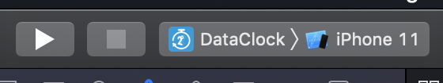

# Data Clock

Data Clock was developed on [React Native](https://facebook.github.io/react-native).

Please read through [official documentation](https://facebook.github.io/react-native/docs/getting-started) if this is your first time working on React Native

## Environment

React Native `0.60.5`

node version ios `10.14.1`
node version android `8.10.0`

Xcode version `11.2`
Android Studio `3.5.1`

## Project setup

Please follow installation guidline to setup local environment on the [official page](https://facebook.github.io/react-native/docs/getting-started)

This project uses `yarn` over `npm`
Please install `yarn` by running `brew install yarn` on your command line.
Refer to the [official page](https://yarnpkg.com/lang/en/docs/install/#mac-stable) for any help
Once installed then run 
`yarn`
`cd ios && pod install`
on your command line.

Copy `.env.example` file and create a new file `.env`
Get values from other developers

## Project structure
``` bash
├── android                 # Android native folder
├── app                     # All source codes sits under here
│   ├── __mocks__           # Mock files for jest
│   └── __testData__        # mock data
│   └── assets              # fonts & other assets
│   └── components          # Components
│   └── config              # Config files
│   └── constants           # Shared constants
│   └── helpers             # Shared helpers
│   └── images              # Images
│   └── screens             # Screen - contains logics
│   └── services            # API logics
│   └── themes              # Colors & Metrics
│   └── Router.tsx          # Navitation rule
│   └── types               # Shared types
├── fastlane                # Fastlane setup
├── ios                     # iOS native folder
│   index.js                # Top entry point
└── package.json
```


## Running iOS locally
There are two ways to run iOS locally
1. Command line
Run this command from root folder `react-native run-ios`
2. XCode
Open `ios/DataCloc.xcworkspace` 
Select target simulator and click play button as shown below


## Running Android locally
There are two ways to run Android locally
**1. Command line**
Run this command from root folder `react-native run-android`
**2. Android Studio**
- Open Android Studio
- Select *Open an existing Android Studio project* from the menu
- Select android folder of the project
- Open Tools => AVD Manager
- Select target emmulator
- Click play button oh the header menu


